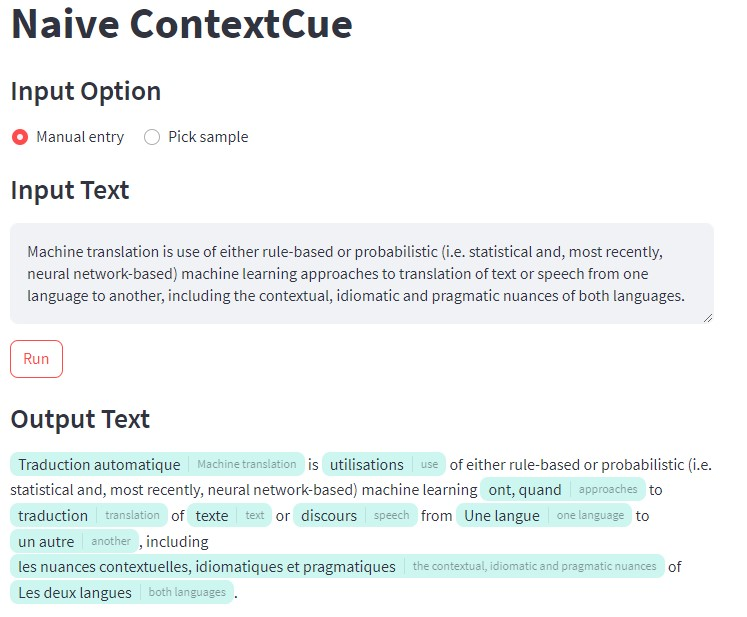

<a name="readme-top"></a>

<!-- PROJECT LOGO -->
<br />
<div align="center">
  <a href="https://github.com/RoundtableML/ContextCue">
    
    <!--  -->
  </a>

  <h2 align="center">Naive ContextCue</h2>

   <p align="center">
    <a href="https://github.com/psf/black"></a>
  </p>

</div>


<!-- ABOUT THE PROJECT -->
## About

### Goal

Lower-bound baseline for the ContextCue project.

### How it is being done

Translate all noun phrases in the text.
It uses `spacy` to get the noun phrases and the [translate](https://github.com/terryyin/translate-python) library to translate.

### Limitations

TODO

### Input-output Samples

TODO

### Screenshots

Manual entry               |  Pick sample
:-------------------------:|:-------------------------:
  |  

<p align="right">(<a href="#readme-top">back to top</a>)</p>


## References

- [translate-python](https://github.com/terryyin/translate-python)

<p align="right">(<a href="#readme-top">back to top</a>)</p>

<!-- GETTING STARTED -->
## Getting Started
### Prerequisites

> This project was developed using `Windows 11` with `python 3.10.9`.

<p align="right">(<a href="#readme-top">back to top</a>)</p>

### Installation

1. Clone the repo
   ```powershell
   git clone https://github.com/RoundtableML/ContextCue.git
   ```
2. Go to `main_baseline` branch
   ```powershell
   git checkout main_baseline
   ```
3. Go to `lower-bound` folder
   ```powershell
   cd .\baseline\lower-bound\
   ```
4. Create a new pip environment (recommended)
   ```powershell
   py -3.10 -m venv .venv
   ```
5. Activate the environment
   ```powershell
   .\.venv\Scripts\activate
   ```
6. Install the python requirements
   ```powershell
   pip install -r requirements.txt
   ```

<p align="right">(<a href="#readme-top">back to top</a>)</p>


<!-- USAGE EXAMPLES -->
## Usage

```powershell
streamlit run streamlit_app.py
```

<p align="right">(<a href="#readme-top">back to top</a>)</p>


## Roadmap

- [x] Implement simple interface with streamlit
- [x] Add NP chunking 
- [x] Add third-party translation
- [ ] What comes next?

<p align="right">(<a href="#readme-top">back to top</a>)</p>
